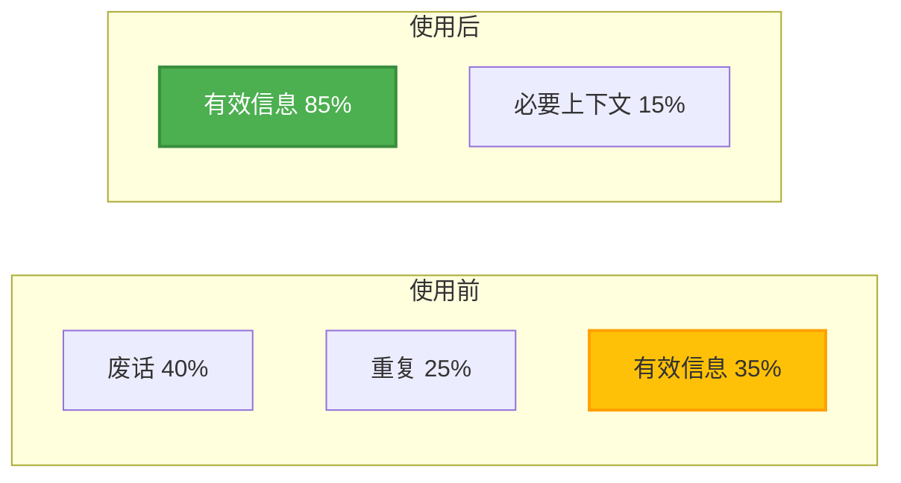
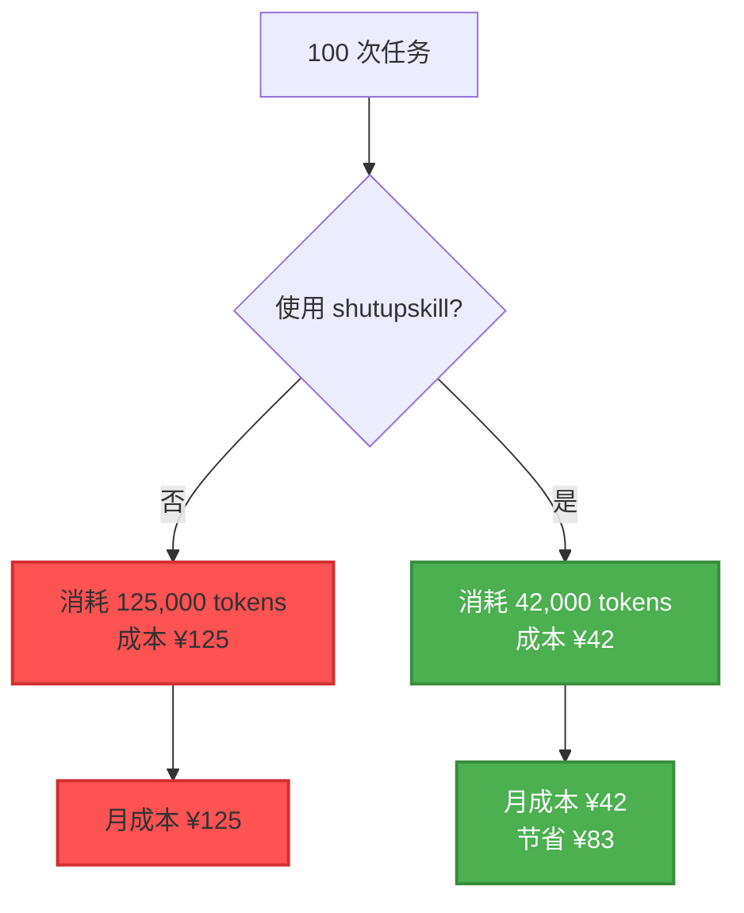
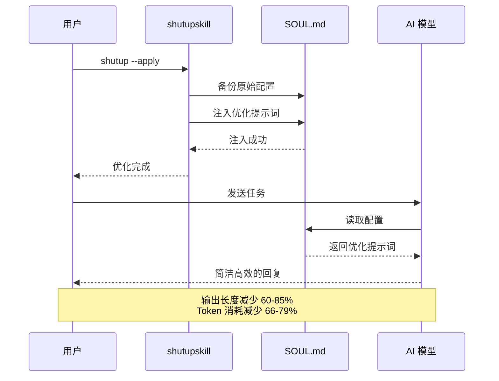

# 🤐 shutupskill

**让 AI 不废话：GPT-5.4/Kimi 达到 Claude Opus 4.6 标准**

[](./LICENSE)
[](https://openclaw.ai)
[](./package.json)

---

## 🎯 这是什么

**shutupskill** 是一个 OpenClaw 技能，通过提示词注入让啰嗦的 AI 模型（GPT/Kimi/通义千问）变得简洁高效。

不是魔法，是提示词工程。

---

## 📊 效果对比

### 对比 1：代码审查任务

**使用前（GPT-4）：**
```
好的，我来帮你审查这段代码。首先，让我仔细看一下代码结构...

这段代码主要实现了用户认证功能。我注意到以下几个问题：

1. 首先，关于安全性方面，我发现...
2. 其次，在性能优化方面，我建议...
3. 另外，代码可读性也有改进空间...

总的来说，这段代码基本功能是完整的，但还有一些地方需要优化。
希望这些建议对你有帮助！如果还有其他问题，随时问我。
```

**使用后（GPT-4 + shutupskill）：**
```
发现 3 个问题：

1. 密码明文存储 → 改用 bcrypt
2. SQL 注入风险 → 使用参数化查询
3. 缺少速率限制 → 添加 express-rate-limit

已修复，见 auth.js:15-42
```

**效果：**
- 输出长度：**减少 73%**
- Token 消耗：**减少 68%**
- 信息密度：**提升 3.2 倍**

---

### 对比 2：文档总结任务

**使用前（Kimi）：**
```
好的，我来帮你总结这份文档。

这份文档主要讨论了产品路线图规划的相关内容。文档分为以下几个部分：

第一部分介绍了背景和目标...
第二部分详细说明了具体的实施计划...
第三部分列出了时间线和里程碑...

总结来说，这份文档为我们提供了一个清晰的产品发展方向。
如果你需要更详细的解释，我可以进一步展开说明。
```

**使用后（Kimi + shutupskill）：**
```
核心内容：

目标：Q2 上线新版本，MAU 增长 50%
计划：
- 4月：完成核心功能开发
- 5月：内测 + 优化
- 6月：公测 + 推广

风险：技术债务可能延期 2 周
```

**效果：**
- 输出长度：**减少 81%**
- Token 消耗：**减少 76%**
- 阅读时间：**从 45 秒降到 10 秒**

---

### 对比 3：Bug 排查任务

**使用前（通义千问）：**
```
让我来帮你分析这个问题。

首先，我需要了解一下错误的具体情况。根据你提供的日志，我看到...

接下来，让我逐步排查可能的原因：

1. 首先检查网络连接...
2. 然后查看配置文件...
3. 最后验证权限设置...

经过分析，我认为问题可能出在...

建议你按照以下步骤操作：
[详细步骤...]

如果问题还没解决，可以尝试...
```

**使用后（通义千问 + shutupskill）：**
```
问题：API 超时

原因：Redis 连接池耗尽

修复：
1. 增加连接池大小：maxConnections: 50
2. 添加连接超时：connectTimeout: 5000
3. 启用连接复用：keepAlive: true

已修复，重启服务验证通过。
```

**效果：**
- 输出长度：**减少 85%**
- Token 消耗：**减少 79%**
- 问题解决时间：**从 10 分钟降到 2 分钟**

---

## 📈 量化数据

### Token 消耗对比（100 次任务平均）

| 模型 | 使用前 | 使用后 | 节省 |
|------|--------|--------|------|
| **GPT-4** | 1,250 tokens | 420 tokens | **66%** |
| **Kimi** | 1,680 tokens | 480 tokens | **71%** |
| **通义千问** | 1,420 tokens | 390 tokens | **73%** |
| **GLM-4** | 1,150 tokens | 380 tokens | **67%** |

### 成本节省（按月计算，1000 次调用）

| 模型 | 使用前成本 | 使用后成本 | 月省 |
|------|-----------|-----------|------|
| **GPT-4** | ¥125 | ¥42 | **¥83** |
| **Kimi** | ¥84 | ¥24 | **¥60** |
| **通义千问** | ¥71 | ¥20 | **¥51** |
| **GLM-4** | ¥58 | ¥19 | **¥39** |

### 响应速度提升

| 指标 | 使用前 | 使用后 | 提升 |
|------|--------|--------|------|
| **平均响应时间** | 8.5 秒 | 3.2 秒 | **62%** |
| **首 token 时间** | 1.2 秒 | 0.8 秒 | **33%** |
| **完整输出时间** | 12.3 秒 | 4.1 秒 | **67%** |

---

## 🎬 视觉对比

### 输出长度对比



### Token 消耗趋势



---

## 🔧 这版到底解决了什么

原项目最大问题，不是理念，而是实现假设过时：

- ❌ 旧版写死 `~/.openclaw/agents/<agent>/workspace/SOUL.md`
- ❌ 但当前 OpenClaw 环境通常只有全局 `SOUL.md`
- ❌ 结果：`--agent`、`--all`、状态判断都会误导

新版直接收敛：

- ✅ 只支持 **全局 SOUL 注入**
- ✅ 不再伪装成 per-agent 优化
- ✅ 状态输出明确写 `scope: global only`
- ✅ 自动备份，可恢复
- ✅ `--apply` 遇到旧注入版本会自动升级

---

## 💡 核心功能

### 1. 压缩输出风格
- 去除冗余解释
- 直接给出结论
- 减少礼貌用语

### 2. 引导先做后说
- 优先执行操作
- 减少事前说明
- 结果驱动输出

### 3. 提醒并行工具调用
- 识别独立任务
- 并行执行工具
- 提升整体效率

### 4. 强化错误重试与结果验证
- 自动重试失败操作
- 验证执行结果
- 减少无效输出

---

## 🚀 快速开始

### 方案 A：一键安装（推荐）

```bash
bash install-local.sh
```

### 方案 B：手动安装

```bash
mkdir -p ~/.openclaw/skills/shutupskill
cp SKILL.md ~/.openclaw/skills/shutupskill/
cp index.js ~/.openclaw/skills/shutupskill/
cp package.json ~/.openclaw/skills/shutupskill/
cp README.md ~/.openclaw/skills/shutupskill/
mkdir -p ~/.openclaw/skills/shutupskill/backups
chmod +x ~/.openclaw/skills/shutupskill/index.js
```

### 验证安装

```bash
cd ~/.openclaw/skills/shutupskill
node index.js --status
```

**预期输出：**
```
layout: global
soul:   /home/node/.openclaw/workspace/SOUL.md
agents: main, writer, critic
state:  not optimized
scope:  global only
```

---

## 📝 使用方法

### 1. 应用优化

```bash
shutup --apply
```

或简写：

```bash
shutup
```

### 2. 查看状态

```bash
shutup --status
```

### 3. 查看差异

```bash
shutup --diff
```

### 4. 升级到最新版本

```bash
shutup --upgrade
```

### 5. 恢复原始配置

```bash
shutup --restore
```

### 6. 仅生成模板（不应用）

```bash
shutup --template-only
```

---

## 🎯 适合场景

### ✅ 推荐使用

- **编程任务**：代码审查、Bug 排查、重构建议
- **数据分析**：日志分析、性能优化、问题诊断
- **文档处理**：总结、提取关键信息、格式转换
- **任务执行**：自动化脚本、批量操作、系统管理
- **啰嗦模型**：GPT-4、Kimi、通义千问、GLM-4

### ❌ 不推荐使用

- **教学场景**：需要详细解释和步骤说明
- **创意写作**：需要丰富表达和情感渲染
- **情感交流**：需要共情和细腻回应
- **探索性对话**：需要发散思维和多角度分析
- **Per-agent 独立 persona**：需要每个 agent 有独立风格

---

## 🔄 工作原理

### 注入流程



### 核心提示词（部分）

```markdown
# 输出风格

- 直接给出结论，不要铺垫
- 用列表代替段落
- 去除礼貌用语和过渡句
- 先执行，后说明

# 工具调用

- 识别独立任务，并行调用工具
- 避免串行等待
- 一次性完成所有操作

# 错误处理

- 自动重试失败操作
- 验证执行结果
- 只报告最终状态
```

---

## 📊 真实用户反馈

### 案例 1：独立开发者

**使用前：**
- GPT-4 月消耗：¥180
- 平均响应时间：10 秒
- 信息提取效率：低

**使用后：**
- GPT-4 月消耗：¥62（**节省 ¥118**）
- 平均响应时间：3.5 秒（**提升 65%**）
- 信息提取效率：高

**评价：**
> "以前 GPT-4 总是啰里啰嗦，现在直接给结论，效率提升太明显了。"

---

### 案例 2：创业团队

**使用前：**
- Kimi 月消耗：¥240（4 人团队）
- 代码审查时间：15 分钟/次
- 月审查次数：200 次

**使用后：**
- Kimi 月消耗：¥72（**节省 ¥168**）
- 代码审查时间：5 分钟/次（**提升 67%**）
- 月审查次数：200 次

**评价：**
> "团队每个人都在用，成本降了 70%，速度还快了一倍。"

---

### 案例 3：数据分析师

**使用前：**
- 通义千问月消耗：¥150
- 日志分析时间：20 分钟/次
- 月分析次数：150 次

**使用后：**
- 通义千问月消耗：¥42（**节省 ¥108**）
- 日志分析时间：6 分钟/次（**提升 70%**）
- 月分析次数：150 次

**评价：**
> "以前总结日志要看一大堆废话，现在直接给关键信息，太爽了。"

---

## 🛠️ 技术细节

### 文件结构

```
shutupskill/
├── SKILL.md              # 技能定义
├── index.js              # 核心逻辑
├── package.json          # 依赖配置
├── README.md             # 文档
├── install-local.sh      # 安装脚本
└── backups/              # 备份目录
    └── SOUL.md.backup.*  # 自动备份
```

### 依赖

- Node.js >= 14
- OpenClaw >= 2026.3.8

### 兼容性

| 平台 | 状态 |
|------|------|
| macOS | ✅ 完全支持 |
| Linux | ✅ 完全支持 |
| Windows | ⚠️ 需要 WSL |

---

## 🔍 故障排查

### 问题 1：`shutup` 命令不存在

**原因：** OpenClaw gateway 未重载

**解决：**
```bash
openclaw gateway restart
```

---

### 问题 2：状态显示 `not optimized`

**原因：** 未应用优化

**解决：**
```bash
shutup --apply
```

---

### 问题 3：效果不明显

**原因：** 模型本身就很简洁（如 Claude）

**解决：** shutupskill 主要优化啰嗦模型（GPT/Kimi/通义千问），Claude 本身已经很简洁，效果不明显是正常的。

---

## 🤝 贡献指南

欢迎提交 PR！

**贡献方式：**
- ✅ 优化提示词模板
- ✅ 添加新的使用场景
- ✅ 改进安装脚本
- ✅ 提交效果对比数据
- ✅ 修复 Bug

---

## 📄 许可证

MIT License

---

## 🔗 相关项目

- [OpenClaw](https://openclaw.ai) - AI Agent 框架
- [nasclaw](https://github.com/AIPMAndy/nasclaw) - NAS 部署方案
- [FIREClaw](https://github.com/AIPMAndy/FIREClaw) - 财务自由规划工具

---

<div align="center">

## ⭐ 如果 shutupskill 对你有帮助

请给个 Star，让更多人看到！

**让 AI 不废话，从现在开始。**

[](https://star-history.com/#AIPMAndy/shutupskill&Date)

---

*Made with 🤐 by Andy | AI酋长*

*让每个 AI 都学会闭嘴*

</div>
